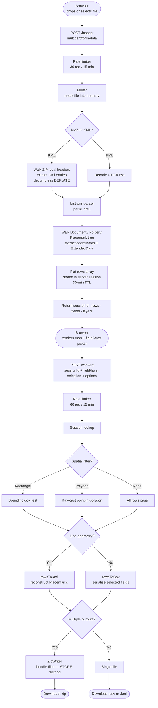

# GeoPoint Saver Simple

A simplified, self-contained web application for converting KML and KMZ files to CSV. Upload files directly through the browser — no email integration, no Google Drive, no database required.

## What It Does

- Accepts KML and KMZ file uploads via drag-and-drop or file browser
- Parses all placemarks and layers from the uploaded files
- Displays points on an interactive Leaflet map
- Supports spatial filtering via drawn rectangles or polygons
- Exports selected layers and fields as CSV (or KML for line geometry)
- Multiple files/layers are bundled into a ZIP archive automatically

## Stack

- **Runtime:** Node.js 18+
- **Framework:** Express
- **File parsing:** `fast-xml-parser`, `@xmldom/xmldom`
- **Upload handling:** Multer (memory storage)
- **Rate limiting:** `express-rate-limit`
- **Logging:** File-based JSON log (`DATA_DIR/logs/access.log`), in-memory ring buffer (last 1000 entries)
- **Database:** None
- **Frontend:** Vanilla JS, Leaflet, Leaflet.draw

## Quick Start (deploy.sh)

Run as root on a Debian/Ubuntu server:

```bash
git clone https://github.com/dfrederick15/geopoint-saver-simple.git
cd geopoint-saver-simple
bash deploy.sh
```

The script will:
1. Install Node.js 20 if not present
2. Create the data directory (`/opt/geopoint-saver-simple`)
3. Run `npm install`
4. Generate a `.env` file
5. Install and start a systemd service (`geopoint-saver-simple`)

## Manual Setup

```bash
npm install
cp .env.example .env   # or create .env manually
npm start
```

### .env file

```env
PORT=3001
DATA_DIR=/opt/geopoint-saver-simple
```

## Environment Variables

| Variable             | Default                       | Description                                                             |
|----------------------|-------------------------------|-------------------------------------------------------------------------|
| `PORT`               | `3001`                        | TCP port the server listens on (binds to 127.0.0.1)                    |
| `DATA_DIR`           | `/opt/geopoint-saver-simple`  | Directory for log files (`logs/access.log`)                             |

## API Endpoints

| Method | Path             | Description                                                   |
|--------|------------------|---------------------------------------------------------------|
| POST   | `/inspect`       | Upload KML/KMZ files; returns parsed rows, fields, and layers |
| POST   | `/convert`       | Convert a parsed session to CSV/KML/ZIP using a `sessionId`   |
| POST   | `/parse-polygon` | Upload a KML/KMZ file; extract the first polygon for spatial filtering |
| GET    | `/load`          | Returns current server load percentage                        |

## Upload Data Flow



## Security

- **No cookies or sessions stored client-side:** User identity uses a UUID stored in `localStorage` and sent as `X-User-Id`.
- **Rate limiting:** `/inspect` is limited to 30 requests per 15 minutes per IP; `/convert` to 60 requests per 15 minutes.
- **Security headers:** `X-Content-Type-Options`, `X-Frame-Options`, and a strict `Content-Security-Policy` are set on every response.
- **No file persistence:** Uploaded files are held in memory only for the duration of the session (max 30 minutes) and never written to disk.
